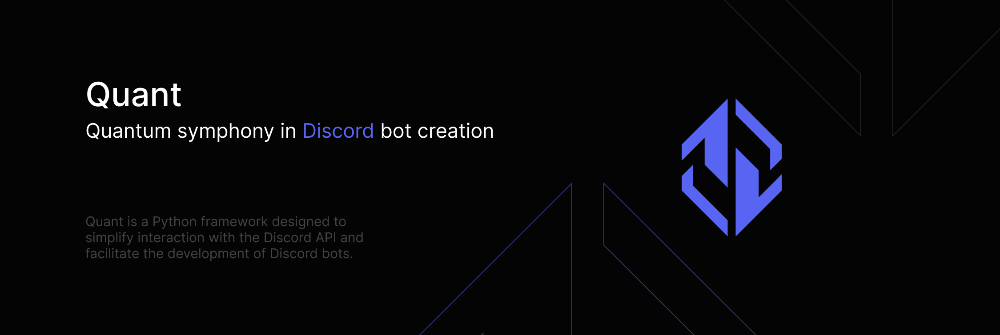

<p align="center">
    <a href="https://discord.gg/MnECK7DJ6n">
        
    </a>
</p>

# **LIBRARY UNDER DEVELOPMENT**
So, if you catch some bugs you can create issue or join to support server (click banner)

## Example Usage

Here's an example code showcasing how to use quant:

```python
from quant import Client, Intents
from quant.events import ReadyEvent

client = Client(
    token="Bot YOUR_DISCORD_BOT_TOKEN",
    intents=Intents.ALL,
    prefix="!"
)


async def on_ready(event: ReadyEvent):
    print('Bot is ready!')


client.add_listener(on_ready)
client.run()
```
Replace `YOUR_DISCORD_BOT_TOKEN` with your actual Discord bot token.

# Slash Commands

```python
from quant import (
    Client,
    SlashCommand,
    SlashOption,
    InteractionContext
)

client = Client(token="Bot YOUR_DISCORD_BOT_TOKEN")


# Echo bot
async def slash_command_callback(context: InteractionContext) -> None:
    text = await context.get_option("text")
    await context.interaction.respond(content=text)


command = SlashCommand(
    name="say",
    description="Say something",
    options=[
        SlashOption(name="text", description="your text", required=True)
    ]
)
command.set_callback(slash_command_callback)

client.run()
```

# [Official support server](https://discord.gg/MnECK7DJ6n)

# Getting Started
## Installation:
You can install quant using pip:

`pip install quant`

# Usage:

Create a new instance of Client by providing your Discord bot token and desired options.
Define callback functions for your commands and events.
Add commands and event listeners using the appropriate methods provided by the Client class.
Start the bot using client.run().

# Documentation:
Coming soon.


# Contibuting:
Coming soon.


# License:
Quant is licensed under the MIT License. See the [LICENSE](https://github.com/MagM1go/quant/blob/main/LICENSE) file for more details.


# Thanks
Thanks to JetBrains for open source license

You can apply it [here](https://www.jetbrains.com/community/opensource/).